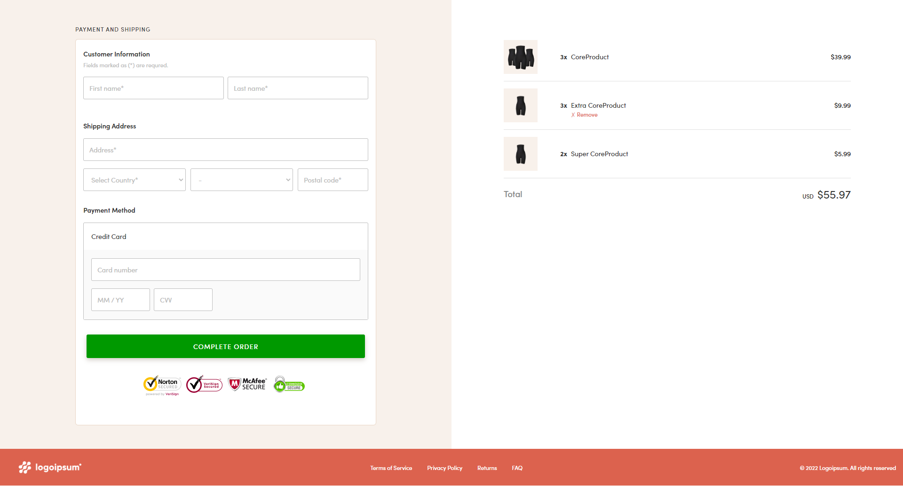
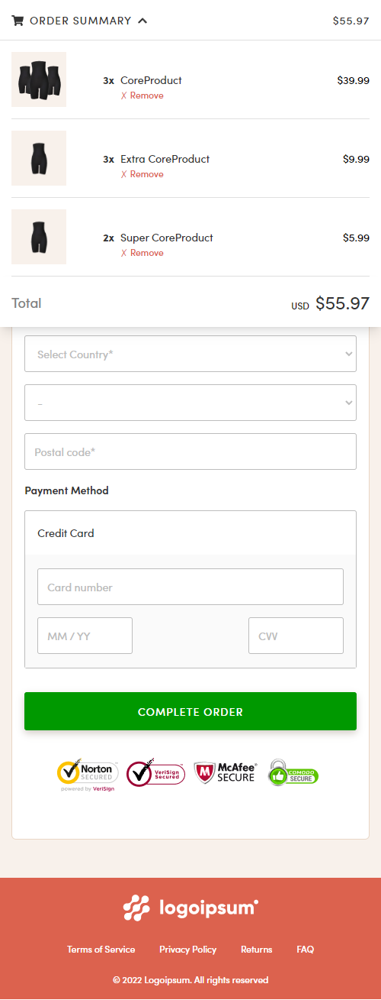

# CommerceCore Front End Task

This project was created by using ReactJS and TailwindCSS.

## How to run

To run the app install required dependencies and run `npm start`.
Open [http://localhost:3000](http://localhost:3000) to view it in your browser.

## Live on heroku

## Screenshots

### Desktop

### Mobile

